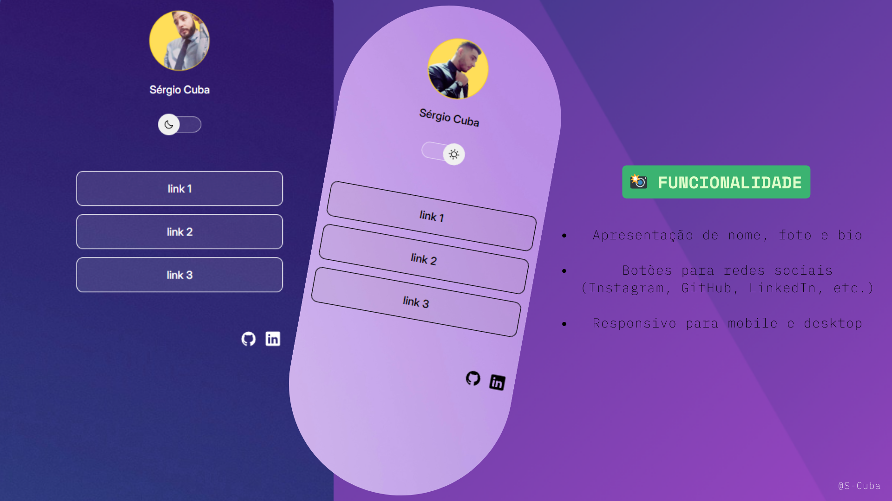

# 🌟 Sobre Mim - Página Pessoal

Uma página web simples e responsiva criada para apresentar informações pessoais, habilidades e redes sociais. Desenvolvida com HTML, CSS, JavaScript, e Figma.

 

  

## 🧑 Sobre o Projeto

Este projeto tem como objetivo servir como um portfólio pessoal e centralizador de links de redes sociais.

 

## 🔗 Acesse o Projeto

[🔗 Clique aqui para visitar a página](https://github.com/ShCuba1/Sobre-mim)

 

## 🛠 Tecnologias Utilizadas

- **HTML5** – estrutura do site
- **CSS** – estilização responsiva e animações
- **JavaScript** – interatividade da página
- **Figma** – design

  

@S-Cuba</h1>
